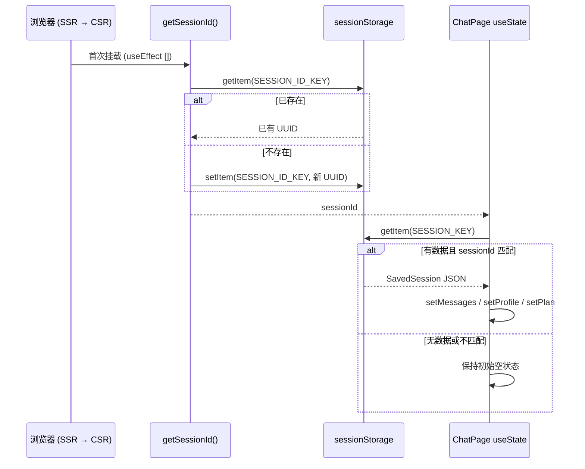
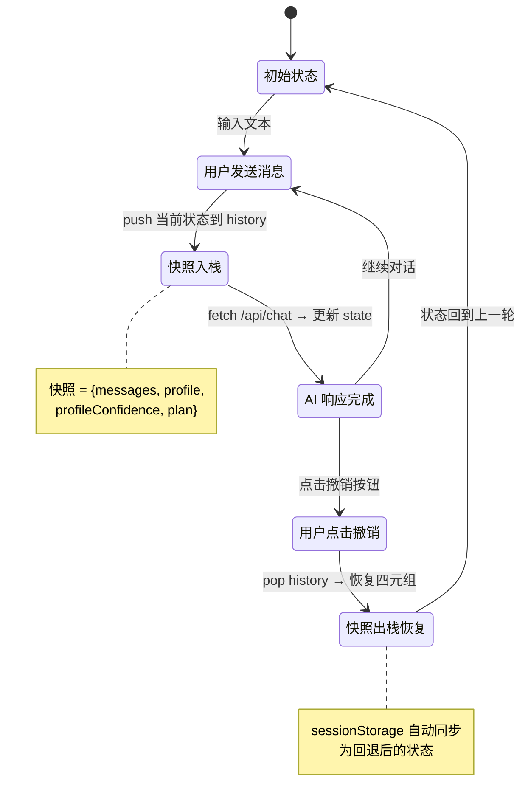
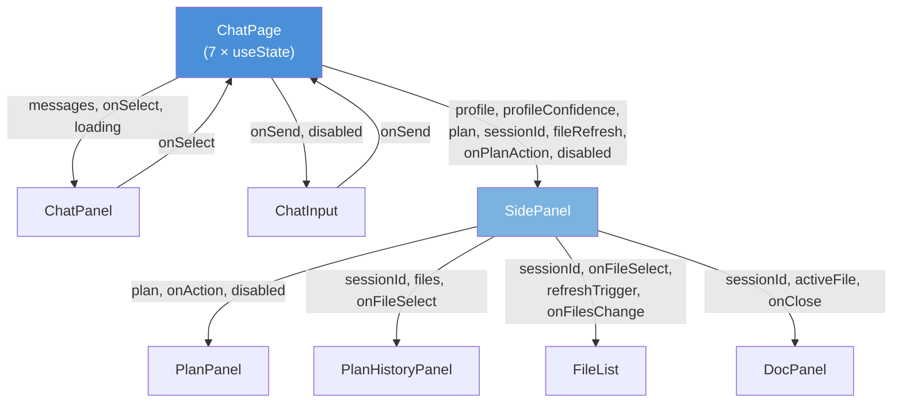

本页深入剖析 **人人都能做科研** 前端的状态管理架构——一个零外部依赖、以 `useState` 为核心、`sessionStorage` 为持久化介质、快照栈为撤销基础的轻量方案。全文围绕 `ChatPage` 这个唯一的顶层有状态组件展开，覆盖状态声明、会话序列化/反序列化、快照式撤销、会话重置以及自顶向下的数据流传递五个维度。读者需要对 React Hooks 和浏览器 Storage API 有基本认知。

Sources: [page.tsx](src/app/page.tsx#L1-L219)

## 状态全景：七个 useState 构成的单一状态树

`ChatPage` 组件声明了七个 `useState`，它们共同构成了一棵**扁平但内聚**的状态树——没有使用 Context、Redux 或 Zustand，所有状态通过 props 显式传递给子组件。这种设计在 MVP 阶段简化了心智模型，也避免了因过早抽象带来的类型传播复杂度。

Sources: [page.tsx](src/app/page.tsx#L29-L39)

下表列出全部七个状态变量的类型、职责与初始值：

| 状态变量 | 类型 | 职责 | 初始值 |
|---|---|---|---|
| `messages` | `ChatMessage[]` | 对话消息列表（用户 + 助手） | `[]` |
| `profile` | `UserProfileState \| null` | 用户画像（10 字段） | `null` |
| `profileConfidence` | `Record<string, number>` | 画像各字段置信度（0~1） | `{}` |
| `plan` | `PlanState \| null` | 当前科研探索计划 | `null` |
| `sessionId` | `string` | 会话唯一标识（UUID v4） | `""` |
| `loading` | `boolean` | 是否正在等待 AI 响应 | `false` |
| `fileRefresh` | `number` | 文件列表刷新计数器 | `0` |
| `history` | `Snapshot[]` | 撤销快照栈 | `[]` |

其中 `messages`、`profile`、`profileConfidence`、`plan` 四个变量是**会话持久化的完整载体**，它们被序列化为一个 `SavedSession` 对象写入 `sessionStorage`。`history` 则是撤销机制的核心数据结构，它不在持久化范围内——页面刷新即丢失，这是有意为之的设计决策。

Sources: [page.tsx](src/app/page.tsx#L12-L18), [triage-types.ts](src/lib/triage-types.ts#L113-L169)

## sessionStorage 持久化：双 Key 与 Hydration 安全

### 双 Key 设计

持久化机制使用两个 sessionStorage key：

| Key | 常量 | 值类型 | 用途 |
|---|---|---|---|
| `triage:session-id` | `SESSION_ID_KEY` | UUID string | 会话身份标识 |
| `triage:chat-session` | `SESSION_KEY` | JSON（`SavedSession`） | 完整会话快照 |

`SESSION_ID_KEY` 的写入时机早于 React 渲染——`getSessionId()` 函数在组件外部也可调用，它采用 **"有则复用、无则创建"** 的幂等模式。这个 ID 有双重作用：一是作为后端 `userspace` 文件系统的会话隔离键，二是作为 `SavedSession` 的校验令牌。

Sources: [page.tsx](src/app/page.tsx#L9-L27)

### 序列化：声明式自动保存

保存逻辑是一个**响应式 `useEffect`**，它监听五个依赖项——`messages`、`profile`、`profileConfidence`、`plan`、`sessionId`。任意一个变化都会触发一次完整的 `JSON.stringify` 写入 `sessionStorage`：

```
useEffect → 依赖变化 → JSON.stringify(SavedSession) → sessionStorage.setItem
```

这种设计意味着**不存在"忘记保存"的风险**——只要 React 状态更新，sessionStorage 就同步刷新。`sessionId` 为空时（SSR 阶段或重置瞬间）会跳过写入，避免序列化一个不完整的会话。

Sources: [page.tsx](src/app/page.tsx#L61-L67)

### 反序列化：Hydration Guard 模式

恢复逻辑同样是一个 `useEffect`，但它只在组件挂载时执行一次（依赖数组为 `[]`）。这个 `useEffect` 完成了两件事：调用 `getSessionId()` 获取/创建会话 ID，然后从 `sessionStorage` 读取并解析 `SavedSession`。

这里有一个关键的**校验步骤**：解析出的 `saved.sessionId` 必须与当前 `getSessionId()` 返回的 ID 严格匹配。这是一个防御性检查——如果用户在一个标签页创建了新会话，但另一个旧标签页的 sessionStorage 中残留着不同的 sessionId，校验不通过就不会恢复旧数据。这本质上是一种**轻量的乐观并发控制**。

整个恢复过程被 `try-catch` 包裹，解析失败时静默忽略——这保证了即使 sessionStorage 数据被篡改或损坏，应用也不会崩溃。



Sources: [page.tsx](src/app/page.tsx#L42-L58)

## 撤销机制：快照栈与原子恢复

### 快照入栈时机

撤销机制采用**经典的 Command/Undo 栈模式**——在每轮用户消息发送之前，将当前完整状态推入 `history` 数组。快照的数据结构是 `{ messages, profile, profileConfidence, plan }` 四元组，不包含 `loading`、`fileRefresh` 等瞬时状态。

入栈操作发生在 `sendMessage` 回调的第一行，使用**展开运算符浅拷贝** `messages` 数组（`[...messages]`），同时对 `profile`、`profileConfidence`、`plan` 直接引用赋值。这种策略是合理的：`profile` 和 `plan` 在后续的 `sendMessage` 中会被整体替换（而非就地修改），所以快照中的引用不会被污染。

Sources: [page.tsx](src/app/page.tsx#L73-L74)

### 快照出栈与原子恢复

`handleUndo` 回调从 `history` 栈顶取出最后一个快照，**原子性地**恢复四个状态变量：

```
handleUndo → history.pop() → setMessages / setProfile / setProfileConfidence / setPlan
```

这里的"原子性"不是指事务隔离，而是指**四个 setter 在同一个同步执行上下文中依次调用**。React 18 的自动批处理（automatic batching）确保这四次 `setState` 只触发一次重渲染，避免了中间状态的闪烁。

恢复后，`history` 通过 `prev.slice(0, -1)` 裁剪掉已消费的快照。如果栈为空，`handleUndo` 不执行任何操作——空操作比报错更安全。

Sources: [page.tsx](src/app/page.tsx#L165-L175)

### 撤销的边界与约束

| 场景 | 行为 | 原因 |
|---|---|---|
| 首轮对话 | `history` 为空，撤销按钮 disabled | 无快照可恢复 |
| AI 正在思考 | `loading === true`，撤销按钮 disabled | 防止在网络请求中途回滚导致状态不一致 |
| 连续多次撤销 | 每次弹出栈顶一个快照 | 栈的 LIFO 特性确保按时间倒序回溯 |
| 页面刷新 | `history` 丢失，撤销按钮 disabled | 快照不持久化到 sessionStorage（有意设计） |
| 撤销后的自动保存 | 恢复的状态立即触发 sessionStorage 写入 | 持久化 useEffect 的响应式触发 |

撤销后自动保存是一个值得注意的交互——用户点击"撤销"后，sessionStorage 立刻被覆盖为回退后的状态。这意味着**撤销操作本身不可撤销**（除非后端还有对应的数据残留）。在 MVP 阶段这是可接受的折衷，后续可通过双栈（undo stack + redo stack）来增强。

Sources: [page.tsx](src/app/page.tsx#L186-L191)



## 会话重置：双阶段清理

`handleReset` 回调执行一次**彻底的会话重置**，其操作序列如下：

1. **清除持久化**：`sessionStorage.removeItem(SESSION_KEY)` + `sessionStorage.removeItem(SESSION_ID_KEY)`
2. **重置全部 useState**：`messages → []`、`profile → null`、`profileConfidence → {}`、`plan → null`、`history → []`、`sessionId → ""`
3. **延迟生成新 sessionId**：通过 `setTimeout(() => { ... }, 0)` 在下一个事件循环中创建新的 UUID

第三步的 `setTimeout(0)` 是一个微妙但重要的技巧——如果在同步代码中直接 `setSessionId(crypto.randomUUID())`，React 的批处理可能会在旧的 sessionId（空字符串）还没完全清除时就触发持久化 useEffect 的守卫检查（`if (!sessionId) return`），导致一次无意义的空写入。延迟到下一个微任务周期确保状态清理先完成，再建立新的会话标识。

重置后，后端的 `userspace` 目录中旧会话的文件仍然保留（文件系统不做级联删除），新会话将创建全新的文件命名空间。

Sources: [page.tsx](src/app/page.tsx#L149-L163), [page.tsx](src/app/page.tsx#L196-L199)

## 数据流拓扑：自顶向下的 Props 传递

`ChatPage` 作为**唯一的顶层状态持有者**，通过 props 将状态分发到五个子组件。所有子组件均为无状态的纯展示组件（除 `SidePanel` 内部维护 `activeFile` 和 `files` 等局部 UI 状态外），状态变更只能通过回调函数上报到 `ChatPage`。



上图中实线箭头表示 props 传递方向，从 `ChatPanel` 和 `ChatInput` 回指 `ChatPage` 的箭头表示**回调函数触发的状态变更路径**。用户在 `ChatPanel` 中点击选项或在 `ChatInput` 中提交文本，最终都汇入 `sendMessage`（或其包装函数 `handleSelect`），由 `ChatPage` 统一驱动状态更新、快照入栈、API 请求和持久化。

Sources: [page.tsx](src/app/page.tsx#L177-L218), [side-panel.tsx](src/components/side-panel.tsx#L41-L128)

## 设计决策总结与演进路径

| 设计点 | 当前方案 | 优势 | 已知局限 | 可能演进方向 |
|---|---|---|---|---|
| 状态容器 | `useState` × 7 | 零依赖、类型安全、心智模型简单 | 跨组件 props 传递层级深 | `useReducer` 或 Zustand |
| 持久化介质 | `sessionStorage` | 标签页隔离、API 简单、无需后端 | 关闭标签即丢失、~5MB 上限 | IndexedDB 或服务端持久化 |
| 序列化格式 | `JSON.stringify` 整体快照 | 实现极简 | 大对话历史时性能下降 | 增量 patch 或消息分页 |
| 撤销模型 | 单栈快照 | 实现简单、原子恢复 | 无 redo、页面刷新后丢失 | 双栈（undo + redo）+ 持久化 |
| 会话标识 | `crypto.randomUUID()` | 全局唯一、无需协商 | 纯前端生成，无法跨设备 | 服务端签发 sessionId |

Sources: [page.tsx](src/app/page.tsx#L1-L219), [triage-types.ts](src/lib/triage-types.ts#L113-L169)

---

**相关阅读**：
- 了解这七个状态变量如何驱动对话阶段推进，参阅 [对话阶段状态机：greeting → profiling → clarifying → planning → reviewing](7-dui-hua-jie-duan-zhuang-tai-ji-greeting-profiling-clarifying-planning-reviewing)
- 理解 `sessionId` 在后端文件系统中的隔离作用，参阅 [userspace 文件系统：会话隔离、路径安全校验与文件清单管理](20-userspace-wen-jian-xi-tong-hui-hua-ge-chi-lu-jing-an-quan-xiao-yan-yu-wen-jian-qing-dan-guan-li)
- 了解持久化存储的后续演进规划，参阅 [后续扩展方向：持久化存储、Plan 评分与图片产物](26-hou-xu-kuo-zhan-fang-xiang-chi-jiu-hua-cun-chu-plan-ping-fen-yu-tu-pian-chan-wu)