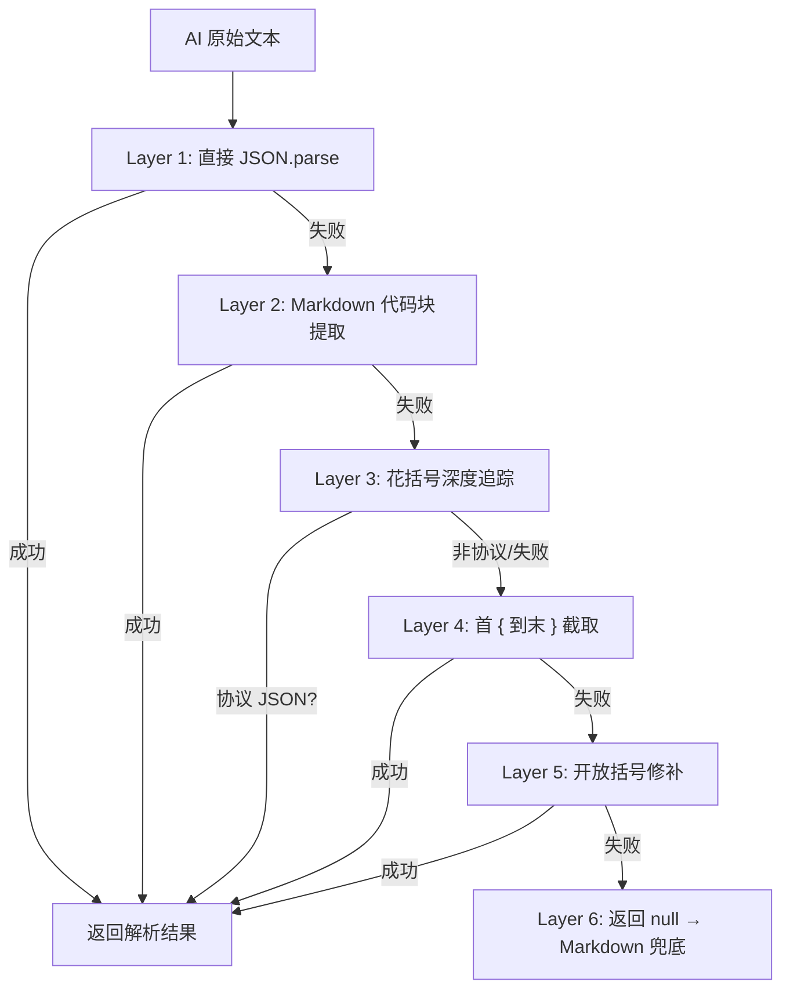
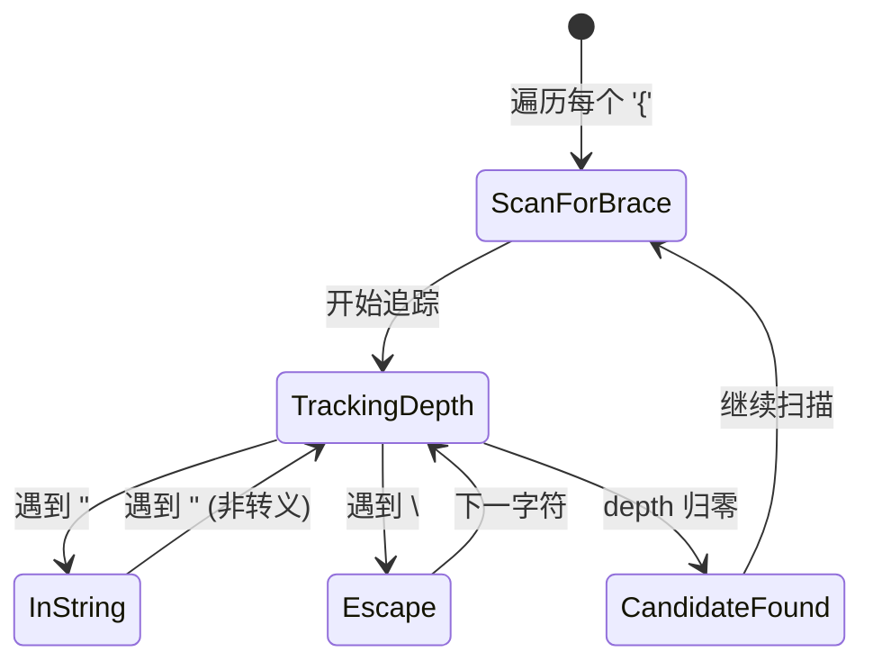
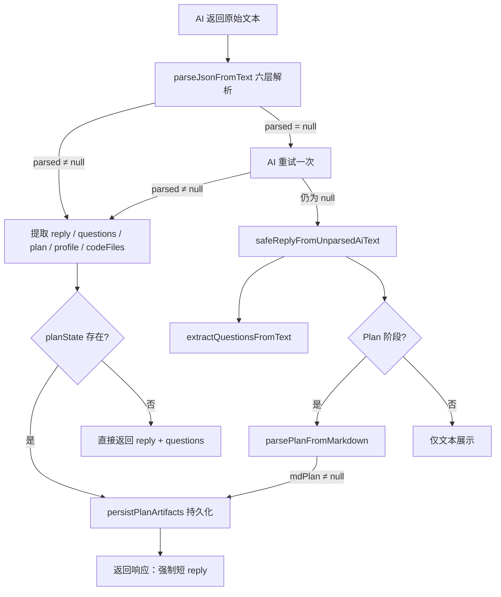

本系统通过一个**六层渐进式解析管线**将大语言模型的自由文本输出转化为结构化数据。尽管 Prompt 层面已要求 AI "必须且只能输出一行合法 JSON"，实际生产中模型仍会频繁违反协议——在 JSON 前附加说明文字、将 JSON 包裹在 Markdown 代码块中、输出截断导致括号不闭合，甚至完全退化为纯 Markdown。`parseJsonFromText` 函数及其配套模块正是为应对这些场景而设计：从最乐观的直接解析，逐步降级到括号深度追踪、协议字段验证，最终退回 Markdown 正则提取。整条管线零外部依赖、纯同步执行，确保任何 AI 输出都能被安全消化。

Sources: [chat-pipeline.ts](src/lib/chat-pipeline.ts#L6-L37), [chat-prompts.ts](src/lib/chat-prompts.ts#L39-L40)

## 解析管线总览：六层降级策略

`parseJsonFromText` 是整个解析管线的入口函数。面对一段 AI 原始文本，它依次尝试六种提取策略，任意一层成功即返回解析结果并终止后续尝试。这种**短路求值**设计既保证了性能，也实现了对 AI 输出质量的弹性适应。



下表汇总了六层策略各自针对的 AI 输出异常模式、匹配逻辑和适用场景：

| 层级 | 策略 | 目标异常模式 | 核心实现 | 失败概率 |
|------|------|-------------|----------|---------|
| 1 | 直接解析 | 理想输出：纯 JSON 字符串 | `JSON.parse(text)` | 最低（理想路径） |
| 2 | 代码块提取 | `` ```json ... ``` `` 包裹 | 正则 `/\`+\`(?:json)?\s*\n?([\s\S]*?)\n?\`+\`/` | 低 |
| 3 | 深度追踪 + 协议验证 | JSON 前后夹杂说明文字、多段 JSON 混合 | `extractBalancedJsonCandidates` + `isProtocolJson` | 中 |
| 4 | 首尾花括号截取 | JSON 被自然语言包裹、首 `{` 前/末 `}` 后有冗余 | `indexOf("{")` + `lastIndexOf("}")` | 中高 |
| 5 | 开放括号修补 | 截断导致右侧 `}` 缺失 | 计算括号深度差，追加缺失的 `}` | 高 |
| 6 | 返回 null | 以上全部失败 | 触发 Markdown 兜底管线 | 终极降级 |

Sources: [chat-pipeline.ts](src/lib/chat-pipeline.ts#L6-L37)

## Layer 1-2：直接解析与代码块提取

**Layer 1** 是最乐观的路径——直接将完整文本喂给 `JSON.parse`。当模型严格遵守 Prompt 指令、输出纯 JSON 字符串时，此层即可命中。这是系统在"一切正常"时的快速通道，没有正则开销、没有字符串操作，仅一次标准库调用。

**Layer 2** 应对一种极常见的模型行为：模型尽管被要求"不要输出代码块标记"，但仍然习惯性地将 JSON 包裹在 `` ```json ... ``` `` 中。此层通过非贪婪正则匹配提取代码块内容，再对内容执行 `JSON.parse`。注意正则使用了 `[\s\S]*?` 非贪婪模式，确保在多代码块文本中只取第一个匹配。

Sources: [chat-pipeline.ts](src/lib/chat-pipeline.ts#L7-L11)

## Layer 3：花括号深度追踪与协议验证

这是整个管线中最精巧的一层。当 Layer 1-2 均失败时，说明 JSON 被嵌入在一段更长的文本中（典型场景：模型在 JSON 前附加了"阶段：Plan 调整"之类的处理摘要，或者在多轮对话中输出了多个 JSON 片段）。

`extractBalancedJsonCandidates` 的实现采用了**有限状态机**遍历：对文本中每个 `{` 起始位置，逐字符推进，追踪花括号深度，同时维护 `inString` 和 `escaped` 状态以正确处理 JSON 字符串内的花括号。当深度回归零时，截取该区间作为候选 JSON 子串。



所有候选子串产生后，逐个尝试 `JSON.parse`。**关键点**：解析成功并不意味着采纳——还必须通过 `isProtocolJson` 的协议验证。该函数检查解析结果是否包含六个协议关键字段之一：`reply`、`questions`、`profileUpdates`、`checklistPassed`、`plan`、`codeFiles`。这一层过滤至关重要，它防止了将文本中偶然出现的非协议 JSON（如模型输出的示例数据结构）误认为系统协议。

Sources: [chat-pipeline.ts](src/lib/chat-pipeline.ts#L50-L86), [chat-pipeline.ts](src/lib/chat-pipeline.ts#L39-L48)

## Layer 4-5：截断修复与开放括号修补

**Layer 4** 面对的是"AI 输出正确，但前后有垃圾"的场景。通过 `indexOf` 定位第一个 `{`、`lastIndexOf` 定位最后一个 `}`，取其间的子串尝试解析。这是一种粗粒度的裁剪——对于前后各有一小段自然语言包裹的情况非常有效，但如果文本中间存在多个独立 JSON 对象则可能失败。

**Layer 5** 是管线中唯一的**主动修复**层。当 Layer 4 也失败后，系统推测 AI 输出可能遭遇了 token 截断（`maxTokens` 限制），导致右侧花括号缺失。具体做法是从第一个 `{` 开始截取到末尾，统计花括号深度差（`depth > 0` 表示缺少右括号），然后追加对应数量的 `}` 闭合后再次尝试解析。

这种"补括号"策略在 Plan 阶段尤其关键：Plan 的 JSON 结构较深（嵌套 `plan.actionSteps`、`plan.riskWarnings`、`codeFiles[].content`），占用 token 多，截断风险高。Layer 5 的存在使得即使输出被截断，系统仍有较高概率恢复出有效数据。

Sources: [chat-pipeline.ts](src/lib/chat-pipeline.ts#L20-L35)

## 协议字段识别：isProtocolJson 的角色

`isProtocolJson` 在 Layer 3 中充当**语义过滤器**。它不关心 JSON 的结构完整性（这已由 `JSON.parse` 保证），而关心**业务相关性**——这段 JSON 是不是系统所期望的协议消息？

六个被识别的协议字段精确对应了五个对话阶段的输出协议：

| 协议字段 | 对应阶段 | 来源 Prompt |
|---------|---------|------------|
| `reply` | 全阶段 | 所有阶段指令均要求输出 |
| `questions` | greeting / profiling / clarifying | 用户选项列表 |
| `profileUpdates` | profiling | 画像字段更新数组 |
| `checklistPassed` | clarifying | 前置检查清单通过标志 |
| `plan` | planning / reviewing | Plan 产物对象 |
| `codeFiles` | planning / reviewing | 代码文件产物数组 |

只要解析结果包含其中任意一个字段，即被识别为协议 JSON。这种宽松的"包含即有效"策略确保了即使模型只返回了部分协议字段（如只有 `reply` 没有 `questions`），系统仍然能正确提取。

Sources: [chat-pipeline.ts](src/lib/chat-pipeline.ts#L39-L48), [chat-prompts.ts](src/lib/chat-prompts.ts#L42-L64)

## AI 重试机制：二次请求强制 JSON

在 `parseJsonFromText` 的六层策略之外，API 路由层还部署了一道**重试屏障**。当首次 AI 调用的结果经过六层解析后仍然返回 `null`，系统会构造一条追加消息——`"上一轮回复不是JSON。请严格按照JSON格式重新输出，以{开头以}结尾。"`——将原始对话上下文连同这条纠错指令一同发给 AI 模型，请求第二次输出。

重试调用的参数更为保守：`temperature` 从 `0.4` 降至 `0.3`（降低随机性以提高 JSON 格式遵从率），`maxTokens` 保持 `4096`。这一策略在 `[route.ts](src/app/api/chat/route.ts#L242-L260)` 中实现，最多触发一次，不会无限循环。

Sources: [route.ts](src/app/api/chat/route.ts#L238-L260)

## Markdown 兜底：parsePlanFromMarkdown

当六层 JSON 提取 + 一次重试全部失败时，系统进入终极降级路径：从纯 Markdown 文本中提取 Plan 数据。`parsePlanFromMarkdown` 使用一组精心设计的正则表达式，按 Markdown 标题结构提取 Plan 的各个字段：

| Plan 字段 | 正则匹配模式 | 兜底模式 |
|----------|-------------|---------|
| `userProfile` | `画像` 或 `用户画像` 标题下的内容 | 首个 `# 标题` 文本 |
| `problemJudgment` | `问题判断/分解` 标题下的内容 | 固定值 `"基于对话历史生成"` |
| `systemLogic` | `系统逻辑/判断逻辑/核心假设` 标题下的内容 | 固定值 `"参阅上方详细分析"` |
| `recommendedPath` | `路径/推荐路径` 标题下的内容 | 固定值 `"参阅步骤列表"` |
| `actionSteps` | `步骤` 标题下匹配 `^\d+\.\s+` 的行 | 文本中最后 8 条编号行 |
| `riskWarnings` | `风险` 标题下匹配 `^[-*]\s+` 的行 | 固定值 `["请确认每个步骤的前提条件"]` |

Markdown 兜底仅在 `planning`、`clarifying`、`reviewing` 三个 Plan 产出阶段启用。如果三个核心字段（`userProfile`、`problemJudgment`、`actionSteps`）全部为空，则返回 `null`，表示连 Markdown 结构也不可识别。

Sources: [chat-pipeline.ts](src/lib/chat-pipeline.ts#L179-L237), [route.ts](src/app/api/chat/route.ts#L379-L402)

## 协议泄漏防护：safeReplyFromUnparsedAiText

当 AI 输出完全无法解析为 JSON 时，系统需要将原始文本作为 `reply` 展示给用户。但这里存在一个**协议泄漏风险**：如果文本实际上包含 JSON 协议内容但格式损坏（如缺少逗号、引号未闭合），直接展示会让用户看到 `{"reply":"ok","plan":{...}}` 这样的原始协议数据。

`safeReplyFromUnparsedAiText` 的防护逻辑分两步判断：

1. **阶段判定**：仅在 `planning`、`reviewing`、`clarifying` 三个 Plan 相关阶段生效（这些阶段 AI 通常输出包含 `plan` 字段的复杂 JSON）
2. **模式匹配**：通过正则 `/"reply"\s*:|\"plan\"\s*:|^\s*\{/` 检测文本是否"看起来像协议 JSON"

当两个条件同时满足时，函数返回一条安全的用户提示——`"模型返回了计划数据，但格式解析失败。请再点一次调整，或换一种更短的反馈。"`——而非暴露原始协议文本。在非 Plan 阶段，或文本不包含协议特征时，则走正常的 `extractReplyFromText` 路径，截取第一个编号/列表标记前的文本作为 reply。

Sources: [chat-pipeline.ts](src/lib/chat-pipeline.ts#L170-L177), [chat-pipeline.ts](src/lib/chat-pipeline.ts#L164-L168)

## 问题提取与标准化：从自由文本到选项数组

在 JSON 解析成功时，`questions` 字段通过 `normalizeQuestions` 处理；在 Markdown 兜底路径中，`extractQuestionsFromText` 从文本中提取编号列表或项目符号列表的问题。两条路径最终汇入同一个标准化管线。

`normalizeQuestions` 解决了三个实际问题：

1. **内联子选项拆分**：AI 常将 `"问题题干：A.选项1；B.选项2；C.选项3"` 压缩为一个 questions 元素。`splitInlineSubOptions` 通过正则 `[:：；;]\s*[A-D][.)）]` 检测内联选项边界，将一条复合问题拆为多条独立选项，每条保留完整题干前缀。

2. **题干去重**：当 AI 同时输出 `"接下来你想明确的问题？"`（纯题干）和 `"接下来你想明确的问题：你对MATLAB的熟悉程度？"`（题干+选项）时，`isQuestionStemOnly` 检测纯题干并以 `startsWith` 判定其是否为某个具体选项的前缀，若是则去除纯题干。

3. **上限控制**：最终结果 `slice(0, 6)`，防止选项过多导致 UI 拥挤。

Sources: [chat-pipeline.ts](src/lib/chat-pipeline.ts#L88-L162)

## 管线编排：API 路由中的解析流程

在 `[route.ts](src/app/api/chat/route.ts)` 中，上述所有解析组件被编排为一条完整的决策管线：



关键编排逻辑：当 `planState` 成功提取（无论来自 JSON 还是 Markdown），系统会**强制覆盖** `reply` 为一条简短确认消息（如 `"✅ Plan 已生成，可在右侧面板查看详情。"`），并清空 `questions` 数组。这确保了 Plan 产出时不向用户展示冗余的追问选项。

Sources: [route.ts](src/app/api/chat/route.ts#L238-L424)

## 设计权衡与工程哲学

这套解析管线的核心设计原则是**防御性编程**——不信任 AI 输出的任何格式承诺。尽管 Prompt 层面以最强措辞要求 "必须且只能输出一行合法 JSON"，系统仍然假设模型会违规，并在每一层降级中优雅地处理异常。这种"假设最坏、期望最好"的策略在实践中被证明是必要的：六层解析的每一层都在生产日志中留下了命中记录。

另一项关键权衡是**纯同步实现**。整个解析管线不涉及任何异步 I/O 或外部依赖，`JSON.parse` 是唯一的重量级操作。这使得管线在 API 路由的热路径中零延迟开销，所有耗时都集中在 AI 调用本身。

Sources: [chat-pipeline.ts](src/lib/chat-pipeline.ts#L6-L37), [route.ts](src/app/api/chat/route.ts#L238-L416)

## 阅读导航

- 了解解析后的 Plan 产物如何被拆分为文档、清单与代码文件，参见 [Plan 产物生成：文档、行动清单、科研路径与代码文件](10-plan-chan-wu-sheng-cheng-wen-dang-xing-dong-qing-dan-ke-yan-lu-jing-yu-dai-ma-wen-jian)
- 了解 Prompt 层如何规定每个阶段的 JSON 输出协议，参见 [阶段式 Prompt 设计：每个阶段的 JSON 输出协议](14-jie-duan-shi-prompt-she-ji-mei-ge-jie-duan-de-json-shu-chu-xie-yi)
- 了解 JSON 重试与协议泄漏的完整容错设计，参见 [AI 容错设计：JSON 重试、规则兜底与协议泄漏防护](25-ai-rong-cuo-she-ji-json-zhong-shi-gui-ze-dou-di-yu-xie-yi-xie-lou-fang-hu)
- 了解本管线的契约测试覆盖，参见 [测试体系：Vitest 契约测试覆盖管线、userspace 与分诊](24-ce-shi-ti-xi-vitest-qi-yue-ce-shi-fu-gai-guan-xian-userspace-yu-fen-zhen)